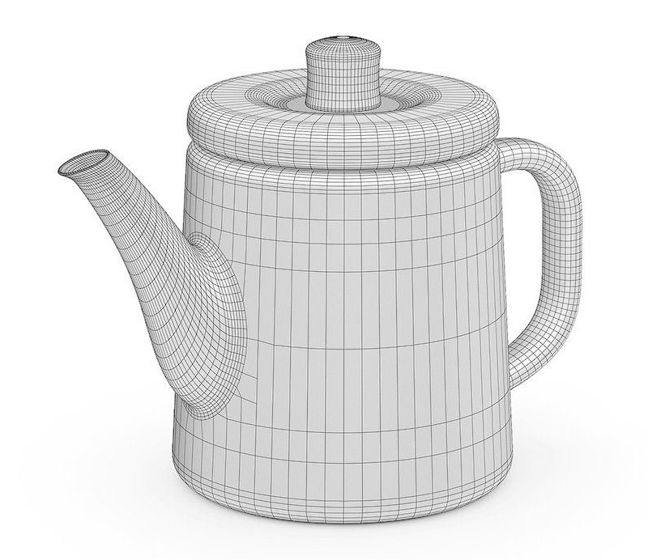

<p align="center">
  
</p>

# obj

**obj** is a parser for the "[.obj](http://paulbourke.net/dataformats/obj/)" model files defined by Wavefront Technologies. It parses only the polygons in obj files and return a list contained all the vertices, UVs and normals.

For a group containing multiple models, the parser does not restore the tree structure of the models since all vertices are converted to world coordinates, but returns a list of all models

## Install

```bash
npm i @hippie/obj
```

## Usage

```typescript
import parseObj from '@hippie/obj'

const models = parseObj(str, opt)
```

## opt

- `name: string` - a customized name for printing, the default value is `"obj"`
- `showTime: boolean` - display the parsing time, the default value is `true`

## Examples

```typescript
import parseObj from '@hippie/obj'

const [model] = parseObj(`
  # This file uses centimeters as units for non-parametric coordinates.

  mtllib 2.mtl
  g default
  v -1.0 -0.0 1.0
  v 1.0 -0.0 1.0
  v -1.0 0.0 -1.0
  v 1.0 0.0 -1.0
  vt 0.0 0.0
  vt 1.0 0.0
  vt 0.0 1.0
  vt 1.0 1.0
  vn 0.0 1.0 0.0
  vn 0.0 1.0 0.0
  vn 0.0 1.0 0.0
  vn 0.0 1.0 0.0
  s off
  g pPlane1
  usemtl initialShadingGroup
  f 1/1/1 2/2/2 4/4/3 3/3/4
`)

console.log(model)
/**
output: ⏬
{
  indices: Uint8Array(6) [0, 1, 2, 0, 2, 3],
  normals: Float32Array(12) [0, 1, 0, 0, 1, 0, 0, 1, 0, 0, 1, 0],
  smoothData: [{ faceIndex: 0, smooth: false }],
  uvs: Float32Array(8) [0, 0, 1, 0, 1, 1, 0, 1],
  vertices: Float32Array(12) [-1, -0, 1, 1, -0, 1, 1, 0, -1, -1, 0, -1],
}
*/
```

So, we can combine it with webgl:

```typescript
// do something...

const posLoc = gl.getAttribLocation(program, 'a_position');
const texLoc = gl.getAttribLocation(program, 'a_texCoord');

const posBuffer = gl.createBuffer();
gl.bindBuffer(gl.ARRAY_BUFFER, posBuffer);
gl.bufferData(gl.ARRAY_BUFFER, model.vertices), gl.STATIC_DRAW);


const texBuffer = gl.createBuffer();
gl.bindBuffer(gl.ARRAY_BUFFER, texBuffer);
gl.bufferData(gl.ARRAY_BUFFER, model.uvs), gl.STATIC_DRAW);


gl.vertexAttribPointer(posLoc, size, type, normalize, stride, offset);

gl.viewport(0, 0, gl.canvas.width, gl.canvas.height);

gl.useProgram(program);
gl.clear(gl.COLOR_BUFFER_BIT);
gl.drawElements(model.indices);
```
